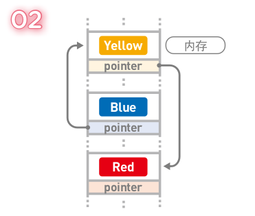
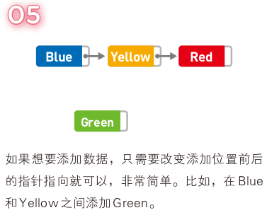
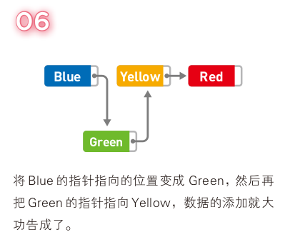
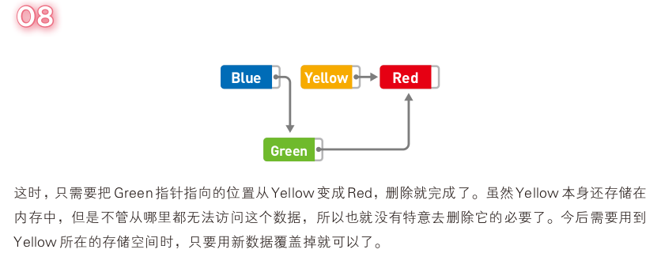

[toc]

### 1-1 什么是数据结构（略）

### 1-2 链表

#### 1-2-1 基本特点

1. 数据呈线性排列
2. 数据删除和添加都很方便，但是访问较为耗时
3. 每个数据项都有一个“指针”，指向下一个数据的内存地址。因此其数据一般都是分散存储于内存中的，无须存储再连续的空间内。
4. 也正因为数据都是分散存储的，所以想要访问数据，只能从第一个数据开始，顺着指针指向依次访问后面的数据。 

#### 1-2-2 数据的添加

#### 1-2-3 数据的删除

> 删除 Yellow 示例

### 1-3 数组

### 1-4 栈

### 1-5 队列

### 1-6 哈希表

### 1-7 堆

### 1-8 二叉树